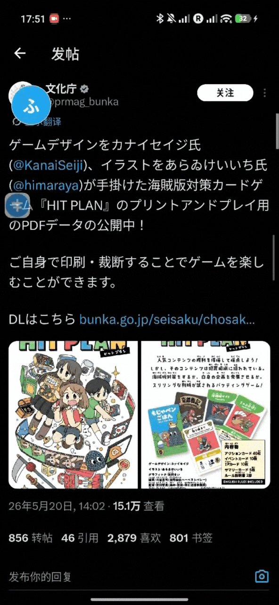

# SOS Furigana 団

<p align="center">
  
</p>

<p align="center">
  <strong>给 X / Twitter 日文 post 加上平假名的 Android 悬浮窗工具</strong>
</p>

<p align="center">
  <a href="https://github.com/realMisakaMikoto/X-Furigana-Overlay">
    
  </a>
  
  
  
</p>

<p align="center">
  <em>听好了！既然日文 post 里到处都是汉字，那在汉字上方出现假名就是理所当然的事。不是为了阿虚你才做的，只是本团长看不下去而已！</em>
</p>

---

## 団長命令

`SOS Furigana 団`，也就是这个仓库里的 `X-Furigana-Overlay`，是一个 Android 自用工具。

它会在你打开 X / Twitter 时，通过无障碍服务读取当前屏幕的文本，只在本地筛选疑似日文 post。你点击悬浮的 `SOS` 图标后，面板会列出当前屏幕识别到的日文内容；再由你亲自选择某一条 post，才会调用你配置的 OpenAI-compatible API 生成 furigana。

简单说：

- 打开 X / Twitter。
- 点一下悬浮的 `SOS` 图标。
- 选择一条日文 post。
- 让模型根据语境给汉字标平假名。
- 复制结果、保存笔记，或者把词加入单词本。

哼，这才像个能让世界热闹起来的工具嘛。

---

## 演示

<p align="center">
  
</p>

---

## 现在能做什么

| 功能 | 団長说明 |
| --- | --- |
| 当前屏幕识别 | 使用 `AccessibilityService` 读取目标 App 当前屏幕文本 |
| 主动扫描 | 点击悬浮按钮时主动识别当前屏幕，减少等待旧事件刷新的时间 |
| 悬浮 SOS 按钮 | `WindowManager` + `TYPE_APPLICATION_OVERLAY`，可拖动 |
| 可移动结果面板 | 悬浮面板支持移动、调整大小和拖动提示条 |
| 日文 post 筛选 | 过滤 X / Twitter UI 文案，优先保留含汉字和假名的日文内容 |
| LLM 注音 | 调用 OpenAI-compatible Chat Completions API 生成平假名读音 |
| Ruby 渲染 | 使用 HTML `<ruby><rt>` 在 WebView 中显示注音 |
| 全汉字倾向标注 | 候选生成和 prompt 约束会尽量覆盖 post 中的汉字与数字 |
| 送り仮名处理 | 尽量避免 `長持ち -> ながもちち` 这种重复读音问题 |
| 数字读音 | 结合日期、年份、时间等上下文处理数字读音 |
| 多 API 配置 | 可以保存多个 API Base URL / Key / Model 组合并切换 |
| 缓存 | 同一条 post 和模型结果会缓存，避免重复请求 |
| 笔记 | 注音过的帖子会以笔记形式保存，可在 App 内查看 |
| 单词本 | 用户手动选词加入单词本，本地 reading hints 会优先推断读音 |
| GitHub 入口 | 首页右上角 GitHub 图标可直接打开项目仓库 |
| 凉宫互动 | 首页 GIF 可以戳，戳多了团长会亲自训话 |

---

## 不许做的事

本项目明确不做这些事：

- 不 root。
- 不使用 Xposed / LSPosed。
- 不 OCR。
- 不逆向 X / Twitter。
- 不修改 X / Twitter APK。
- 不自动上传整个屏幕文本。
- 不读取未配置为目标包名的其他 App 内容。
- 不把 API Key 写死在代码里。

要是敢乱读别人的 App，本团长可是会发火的。

---

## 使用方法

### 1. 构建 APK

Windows:

```powershell
.\gradlew.bat :app:assembleDebug
```

macOS / Linux:

```bash
./gradlew :app:assembleDebug
```

生成位置：

```text
app/build/outputs/apk/debug/app-debug.apk
```

### 2. 安装

```bash
adb install -r app/build/outputs/apk/debug/app-debug.apk
```

### 3. 开启权限

打开 `SOS Furigana 団` 后，按提示开启：

- 无障碍服务权限
- 显示在其他应用上层权限

### 4. 配置 API

在首页填写或新增 API 配置：

- API Base URL
- API Key
- Model

支持 OpenAI-compatible Chat Completions API。常见填写方式：

```text
https://api.openai.com/v1
https://api.openai.com/v1/chat/completions
```

### 5. 开始注音

1. 打开 X / Twitter。
2. 点击屏幕上的 `SOS` 悬浮图标。
3. 等候当前屏幕 post 列表出现。
4. 点击要注音的日文 post。
5. 查看 ruby 注音结果。
6. 复制、保存笔记，或手动选词加入单词本。

---

## 权限与隐私

本工具需要无障碍权限，是因为普通 Android App 没有读取其他 App 屏幕文本的常规 API。

处理原则如下：

- 默认只监听 `com.twitter.android`、`com.x.android` 等目标包名。
- 目标包名可在 App 内配置。
- 当前屏幕文本只用于本地筛选候选 post。
- 只有用户点击某条 post 后，才会把该 post 发送给用户配置的 LLM API。
- API Key 保存在本地设置中。
- 缓存、笔记、单词本也保存在本地。

这不是可疑工具，这是团长批准过的日文学习装备。

---

## 技术栈

```text
Kotlin
Android View / XML
AccessibilityService
WindowManager TYPE_APPLICATION_OVERLAY
WebView
OkHttp
Kotlin Coroutines
SharedPreferences
Gradle Kotlin DSL
```

---

## 项目结构

```text
app/src/main/java/com/example/xjapanesefuriganaoverlay/
├── MainActivity.kt
├── NotesActivity.kt
├── WordbookActivity.kt
├── AddWordActivity.kt
├── AppUi.kt
├── accessibility/
│   ├── XTextAccessibilityService.kt
│   ├── ScreenTextScanner.kt
│   ├── PostDetectionPipeline.kt
│   └── ScanMetrics.kt
├── data/
│   ├── CurrentPostRepository.kt
│   ├── FuriganaCache.kt
│   ├── NoteRepository.kt
│   ├── SettingsRepository.kt
│   └── WordbookRepository.kt
├── furigana/
│   ├── FuriganaClient.kt
│   ├── FuriganaJsonParser.kt
│   ├── FuriganaPromptBuilder.kt
│   ├── JapaneseNumberReading.kt
│   ├── RubyHtmlRenderer.kt
│   └── ...
├── japanese/
│   └── JapaneseTextDetector.kt
└── overlay/
    └── OverlayController.kt
```

---

## 素材

项目使用了凉宫主题视觉元素：

- `SOS.webp`：应用图标与悬浮按钮图标。
- `haruhi-gif/`：首页互动 GIF 素材。
- `基本使用gif.gif`：基础使用演示。

特别鸣谢 **凉宫春日应援团** 提供图片素材。

再特别鸣谢 **凉宫春日黑客松 Galcode 项目** 提供情绪价值支持。没有这种程度的精神补给，阿虚肯定又要磨磨蹭蹭。

---

## Star History

既然都看到这里了，点个 Star 也是很合理的吧？才、才不是本团长想要，只是为了让更多人发现这个项目而已！

<p align="center">
  <a href="https://www.star-history.com/#realMisakaMikoto/X-Furigana-Overlay&Date">
    
  </a>
</p>

---

## 已知限制

- 无障碍节点来自 X / Twitter 当前 UI，页面结构变化可能影响识别效果。
- LLM 响应速度取决于你配置的服务商、模型和网络。
- 人名、地名、网络语、熟字训仍可能需要人工确认。
- 选词读音会优先使用已注音结果里的 reading hints，本地无法确定时才会调用 LLM。
- 悬浮窗在不同系统 ROM 上可能有权限和显示差异。

这些问题不是借口，是下一次团长命令的素材。

---

## License

MIT License。

既然已经这么自由了，就给我拿去做点能让世界更热闹的东西。否则，罚金。
